**quadplay✜** is a fantasy console by [CasualEffects](https://casual-effects.com)
for creating and playing retro-style video games on any device.

- [Play games online](https://morgan3d.github.io/quadplay/console/quadplay.html?)
- [Install on Windows](https://morgan3d.github.io/quadplay/tools/windows-install-quadplay.cmd)
- [Install on macOS or Linux](https://github.com/morgan3d/quadplay/archive/main.zip)
- [Preview the web IDE](https://morgan3d.github.io/quadplay/console/quadplay.html?IDE=1&game=quad://games/quadpaddle)
- [Read the manual](https://morgan3d.github.io/quadplay/doc/manual.md.html)

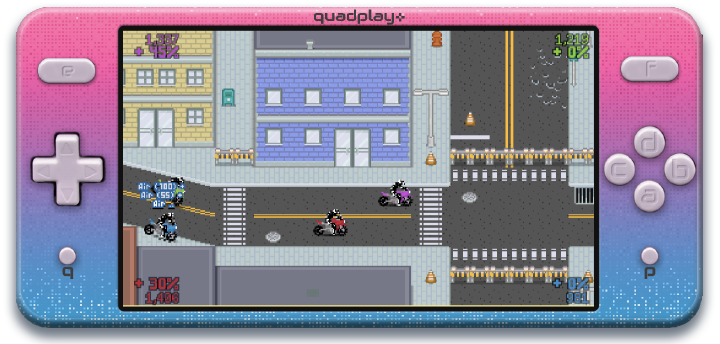

Platforms
========================================================

Create and play games on any laptop, desktop, tablet, or phone. Or,
build your own programmable arcade machine from a Raspberry Pi, Tegra,
or old computer. Here are some of the many supported quadplay
platforms:

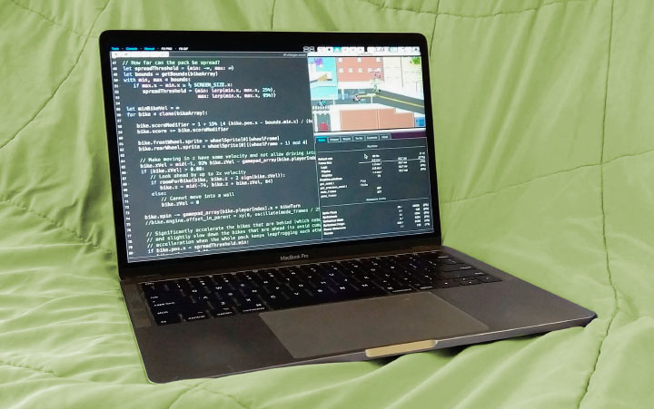 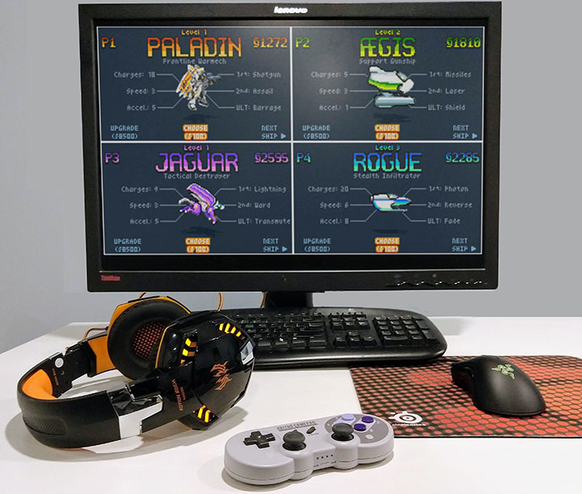 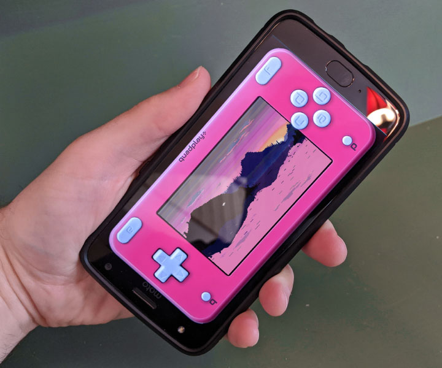 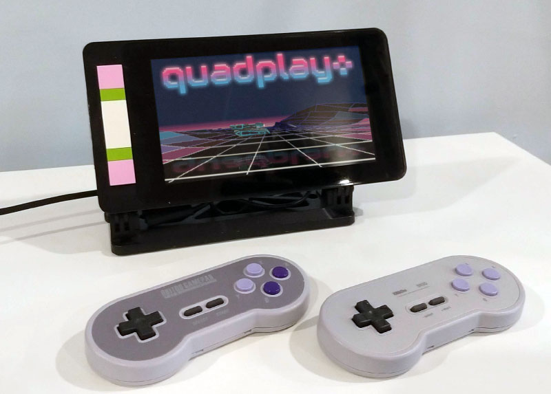 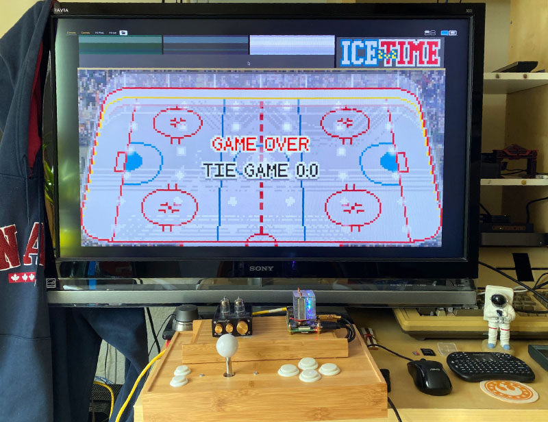 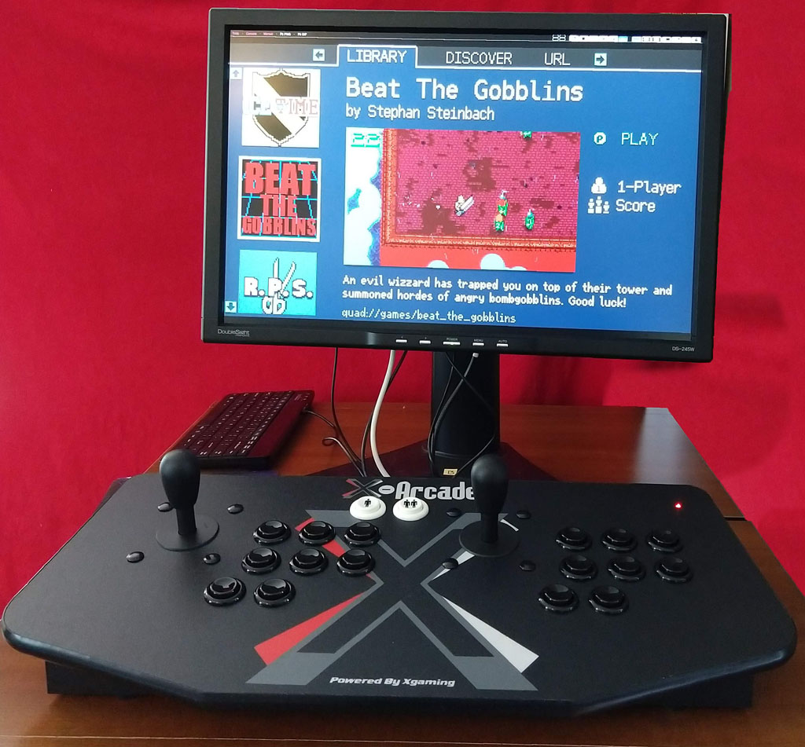 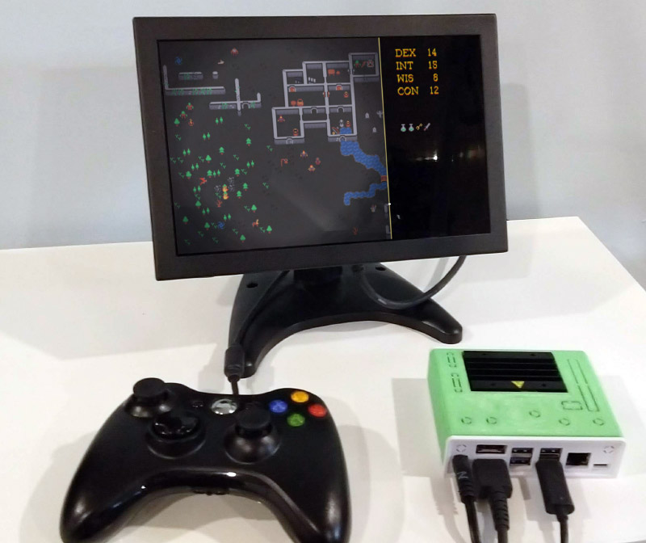 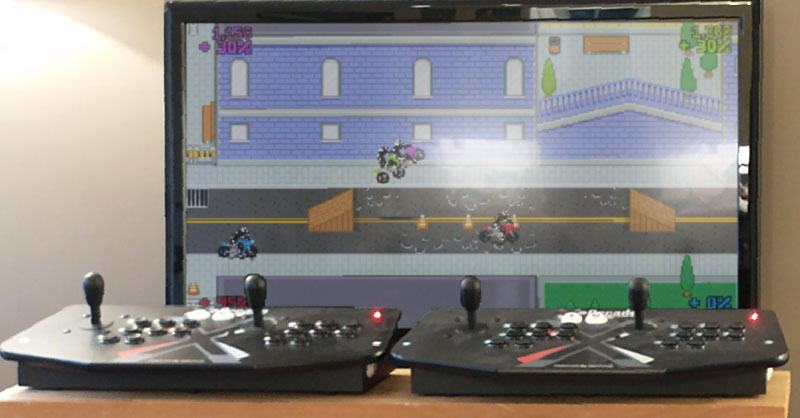 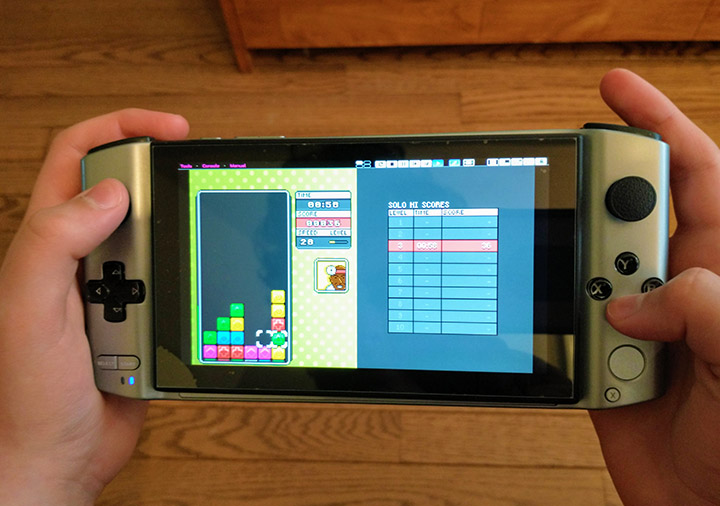 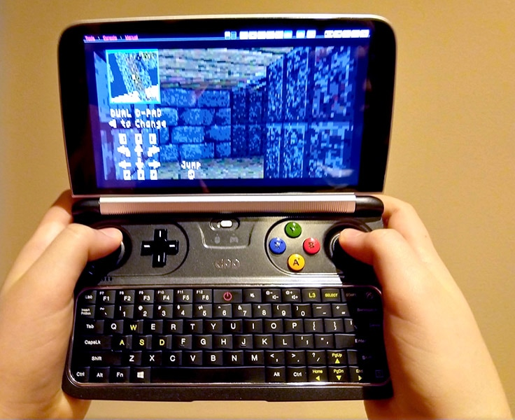

Games
========================================================

Full
--------------------------------------------------------
These full games are included, with source
code. Click to play:

[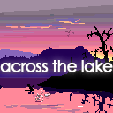](https://morgan3d.github.io/quadplay/console/quadplay.html?game=games/across_the_lake) [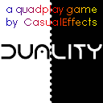](https://morgan3d.github.io/quadplay/console/quadplay.html?game=games/duality)  [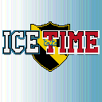](https://morgan3d.github.io/quadplay/console/quadplay.html?game=games/icetime)  [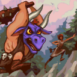](https://morgan3d.github.io/quadplay/console/quadplay.html?game=games/rescue_roguelike) [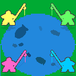](https://morgan3d.github.io/quadplay/console/quadplay.html?game=games/friendly_fishing) [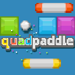](https://morgan3d.github.io/quadplay/console/quadplay.html?game=games/quadpaddle)  [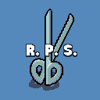](https://morgan3d.github.io/quadplay/console/quadplay.html?game=games/rps)  [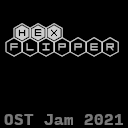](https://morgan3d.github.io/quadplay/console/quadplay.html?game=games/hexflipper) [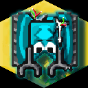](https://morgan3d.github.io/quadplay/console/quadplay.html?game=games/beyond_control)

Examples
--------------------------------------------------------
These short example programs demonstrate specific quadplay
features and programming techniques.

[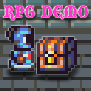](https://morgan3d.github.io/quadplay/console/quadplay.html?game=examples/rpg&IDE=1&autoplay=1)  [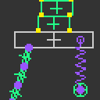](https://morgan3d.github.io/quadplay/console/quadplay.html?game=examples/physics&IDE=1&autoplay=1) [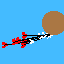](https://morgan3d.github.io/quadplay/console/quadplay.html?game=examples/physics_arrow&IDE=1&autoplay=1) [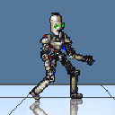](https://morgan3d.github.io/quadplay/console/quadplay.html?game=examples/robot&IDE=1&autoplay=1) [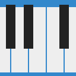](https://morgan3d.github.io/quadplay/console/quadplay.html?game=examples/piano&IDE=1&autoplay=1)  [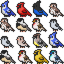](https://morgan3d.github.io/quadplay/console/quadplay.html?game=examples/boids&IDE=1&autoplay=1) [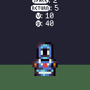](https://morgan3d.github.io/quadplay/console/quadplay.html?game=examples/camera_shake&IDE=1&autoplay=1) [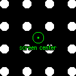](https://morgan3d.github.io/quadplay/console/quadplay.html?game=examples/zoom&IDE=1&autoplay=1)  [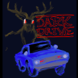](https://morgan3d.github.io/quadplay/console/quadplay.html?game=examples/dark_drive&IDE=1&autoplay=1) [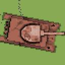](https://morgan3d.github.io/quadplay/console/quadplay.html?game=examples/dual-stick&IDE=1&autoplay=1) [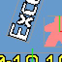](https://morgan3d.github.io/quadplay/console/quadplay.html?game=examples/entity&IDE=1&autoplay=1) [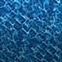](https://morgan3d.github.io/quadplay/console/quadplay.html?game=examples/fluid&IDE=1&autoplay=1)  [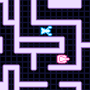](https://morgan3d.github.io/quadplay/console/quadplay.html?game=examples/gridmove&IDE=1&autoplay=1)  [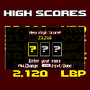](https://morgan3d.github.io/quadplay/console/quadplay.html?game=examples/highscore&IDE=1&autoplay=1) [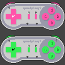](https://morgan3d.github.io/quadplay/console/quadplay.html?game=examples/input&IDE=1&autoplay=1) [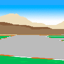](https://morgan3d.github.io/quadplay/console/quadplay.html?game=examples/kart&IDE=1&autoplay=1) [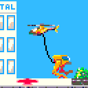](https://morgan3d.github.io/quadplay/console/quadplay.html?game=examples/lift_team&IDE=1&autoplay=1) [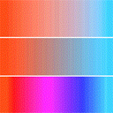](https://morgan3d.github.io/quadplay/console/quadplay.html?game=examples/perceptual_color&IDE=1&autoplay=1) [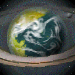](https://morgan3d.github.io/quadplay/console/quadplay.html?game=examples/planetgen&IDE=1&autoplay=1) [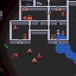](https://morgan3d.github.io/quadplay/console/quadplay.html?game=examples/roguelike&IDE=1&autoplay=1) [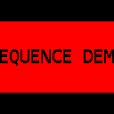](https://morgan3d.github.io/quadplay/console/quadplay.html?game=examples/sequence_demo&IDE=1&autoplay=1)   [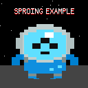](https://morgan3d.github.io/quadplay/console/quadplay.html?game=examples/sproing&IDE=1&autoplay=1)   [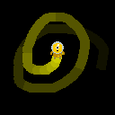](https://morgan3d.github.io/quadplay/console/quadplay.html?game=examples/touch&IDE=1&autoplay=1) [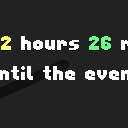](https://morgan3d.github.io/quadplay/console/quadplay.html?game=examples/countdown&IDE=1&autoplay=1)  [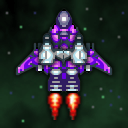](https://morgan3d.github.io/quadplay/console/quadplay.html?game=examples/twin_analog&IDE=1&autoplay=1) [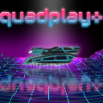](https://morgan3d.github.io/quadplay/console/quadplay.html?game=examples/vaporwave&IDE=1&autoplay=1)   [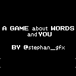](https://morgan3d.github.io/quadplay/console/quadplay.html?game=examples/word_game&IDE=1&autoplay=1)   [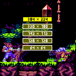](https://morgan3d.github.io/quadplay/console/quadplay.html?game=examples/change_res&IDE=1&autoplay=1) [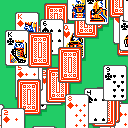](https://morgan3d.github.io/quadplay/console/quadplay.html?game=examples/cards&IDE=1&autoplay=1) [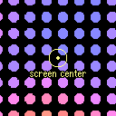](https://morgan3d.github.io/quadplay/console/quadplay.html?game=examples/zoom2D&IDE=1&autoplay=1)  

Features
========================================================

- Create games on Windows, macOS, Linux
- Play your games in any modern web browser on a laptop, desktop, tablet, phone, Raspberry Pi 4, or Jetson Nano
- 60 fps @ 384 x 224 pixels = 12:7 aspect ≈ 16:9.3
- 4096 sRGB (4:4:4) colors
- Four players with virtual controls for D-pad and eight buttons
- Local and safe online multiplayer
- Supports Xbox, Playstation, SNES, Stadia, Switch, 8bitdo, touch screen, and other controllers
- Hundreds of built-in sprites, sounds, and fonts
- Program in PyxlScript, a friendly Python-like language
- Order-independent, 4-bit alpha transparency
- Native 2.5D graphics with z-order
- 9.4 MB of total sprite memory
- Up to 64 sprite and font sheets of up to 1024x1024
- Optional 384 x 224, 320 x 180, 192 x 112, 128 x 128, and [64 x 64](https://itch.io/jam/lowrezjam-2019) screen modes
- Free and open source

Online play is powered by [EvenNode](https://www.evennode.com/) and
[PeerJS](https://peerjs.com/).

Join the Quadplay Revolution
========================================================

You can use an external editor (like VSCode) or simply work entirely
within the provided the browser-based development environment.

To get started, you'll need Windows, macOS, Linux, or Raspberry Pi OS
and the following freely-available software.

_Required_:

- [**This SDK**](https://github.com/morgan3d/quadplay/archive/main.zip), which includes the IDE and assets
- [**Python 3.10**](https://www.python.org/downloads/)
- A **modern web browser** such as Chrome, Edge, Brave, Safari, or Firefox

_Optional_:

- [**The manual**](https://morgan3d.github.io/quadplay/doc/manual.md.html)
- A **code editor** such as [VS Code](https://code.visualstudio.com/), Emacs, or VIM. Use Python mode or install our provided PyxlScript editor extensions
- A TMX map editor such as [Tiled](https://www.mapeditor.org/) or [TileKit](https://rxi.itch.io/tilekit)
- A sprite and font pixel editor such as [Piskel](https://www.piskelapp.com/) or [GrafX2](http://pulkomandy.tk/projects/GrafX2/downloads?order=version&desc=1)
- A [SFX generator](https://www.bfxr.net/) and audio editor such as [Audacity](https://www.audacityteam.org/)
- An account on the [forums](http://quadplay.freeforums.net)
- Follow development online at [@CasualEffects](https://twitter.com/CasualEffects)

See the manual for a getting started guide, the change log, road map,
and notes.

License
========================================================

The quadplay✜ runtime, compiler, and emulator are licensed as
[LGPL3](https://www.gnu.org/licenses/lgpl-3.0.en.html). 

You can create closed-source games with it and distribute your games
however you want, including commercially. 

If you modify the runtime library, compiler, or emulator, then you
must redistribute those changes under the LGPL3.

Portions of the IDE are under different, less-restrictive
open source licenses (BSD, MIT, and public domain).

Quadplay automatically adds asset and library licenses to your
game's credits screen. You don't have to do any work to satisfy
attribution clauses from open source or Creative Commons licenses.

All sounds, sprites, and games distributed with quadplay✜ are Creative
Commons licensed. The copyright and license on each of those is in 
a JSON file next to the asset.

© 2020-2021 Morgan McGuire
